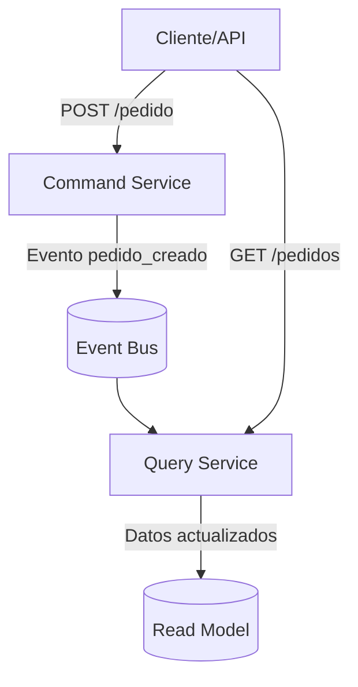
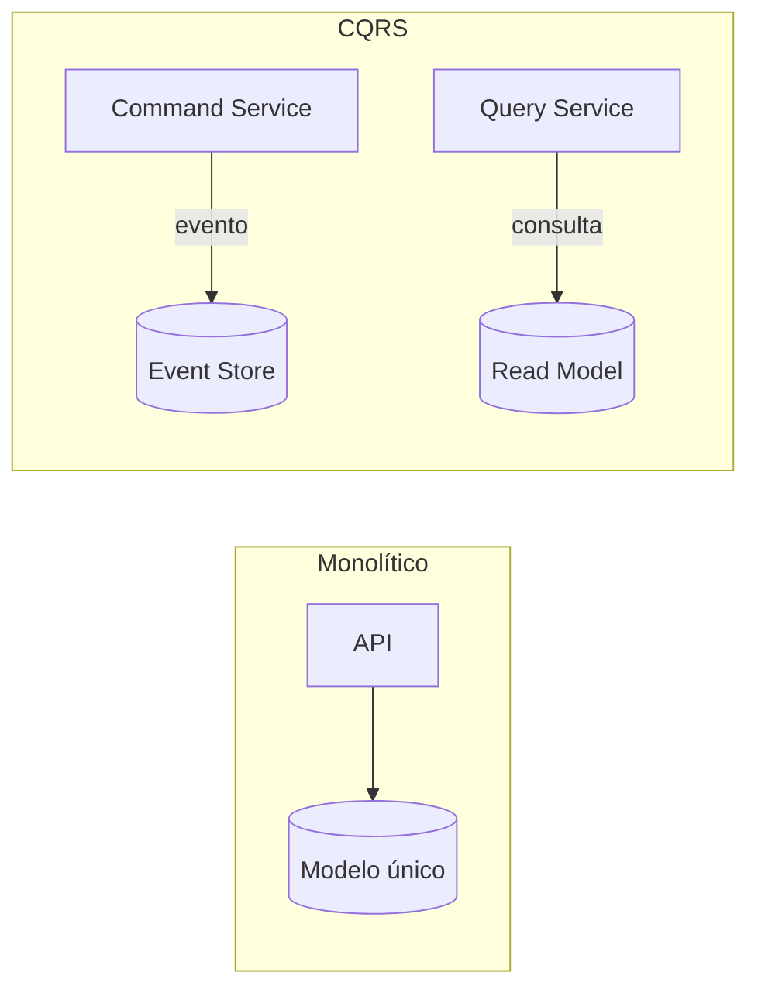
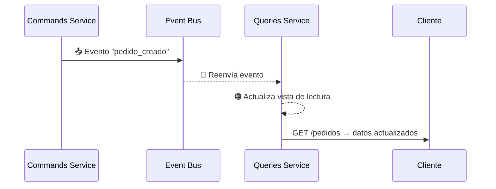

# 4.1 – CQRS: Comandos y Consultas

---

## 🎯 Objetivo

Comprender el patrón **CQRS (Command Query Responsibility Segregation)**, su motivación dentro de arquitecturas de microservicios y cómo separa las responsabilidades de lectura y escritura para mejorar el rendimiento, la escalabilidad y la mantenibilidad del sistema.

---

## 🧩 Concepto

Tradicionalmente, en una aplicación monolítica usamos el **mismo modelo** y la **misma base de datos** para leer y escribir información:

```js
app.post("/pedido", crearPedido);
app.get("/pedido/:id", obtenerPedido);
```

Esto es simple, pero genera **limitaciones** en sistemas distribuidos:

* Dificulta escalar la lectura y escritura de forma independiente.
* Mezcla responsabilidades de lógica de negocio.
* Aumenta el riesgo de bloqueos o inconsistencias cuando hay muchos servicios accediendo al mismo modelo.

👉 **CQRS propone separarlas completamente.**

---

## ⚙️ Principio CQRS

> **Command Query Responsibility Segregation (CQRS)**:
> Separar las operaciones de **lectura (Query)** y **escritura (Command)** en diferentes modelos o servicios.

| Tipo        | Propósito          | Ejemplo                       | Efecto sobre el sistema |
| ----------- | ------------------ | ----------------------------- | ----------------------- |
| **Command** | Ejecuta una acción | Crear pedido, aprobar factura | ✅ Modifica el estado    |
| **Query**   | Consulta datos     | Obtener pedidos del cliente   | ❌ No cambia el estado   |

---

## 🧭 Flujo general




* 🟦 **Command Service:** recibe y valida acciones de negocio.
* 🟧 **Query Service:** mantiene una vista actualizada para consultas.
* ⚙️ **Event Bus:** comunica ambos mundos de forma asíncrona.

---

## 🧱 Beneficios del enfoque CQRS

| Beneficio                       | Descripción                                                                      |
| ------------------------------- | -------------------------------------------------------------------------------- |
| **Escalabilidad independiente** | Podemos escalar lecturas y escrituras por separado.                              |
| **Rendimiento optimizado**      | La lectura puede usar un modelo simplificado (cache, Redis, materialized view…). |
| **Mantenibilidad**              | Código más claro, modelos más simples.                                           |
| **Flexibilidad tecnológica**    | Se pueden usar diferentes bases de datos o lenguajes por lado.                   |
| **Auditoría natural**           | Las acciones se modelan como eventos explícitos.                                 |

---

## 🔍 Comparación visual



*🔹 En un modelo tradicional, las consultas y comandos comparten el mismo modelo.
*🔹 En CQRS, se separan las responsabilidades y se comunican por eventos.

---

## 💡 Ejemplo funcional (Node.js + RabbitMQ)

En este ejemplo, implementamos **dos microservicios** con un **bus de eventos**.

---

### 🟦 1. Servicio de comandos (`commands-service`)

Recibe solicitudes para crear pedidos y publica eventos al bus.

```js
import express from "express";
import amqp from "amqplib";

const app = express();
app.use(express.json());

async function publicarEvento(evento) {
  const conn = await amqp.connect("amqp://rabbitmq");
  const ch = await conn.createChannel();
  const exchange = "eventos_pedidos";
  await ch.assertExchange(exchange, "fanout", { durable: true });
  ch.publish(exchange, "", Buffer.from(JSON.stringify(evento)));
  console.log(`📤 Evento publicado: ${evento.tipo}`);
  await ch.close();
  await conn.close();
}

app.post("/pedido", async (req, res) => {
  const pedido = {
    id: Date.now(),
    cliente: req.body.cliente,
    total: req.body.total,
    estado: "CREADO"
  };
  await publicarEvento({ tipo: "pedido_creado", data: pedido });
  res.json({ status: "ok", pedido });
});

app.listen(5000, () => console.log("🟢 Commands Service en puerto 5000"));
```

---

### 🟧 2. Servicio de consultas (`queries-service`)

Escucha los eventos y mantiene una vista en memoria de los pedidos creados.

```js
import express from "express";
import amqp from "amqplib";

const app = express();
let pedidos = [];

async function escucharEventos() {
  const conn = await amqp.connect("amqp://rabbitmq");
  const ch = await conn.createChannel();
  const exchange = "eventos_pedidos";
  await ch.assertExchange(exchange, "fanout", { durable: true });

  const q = await ch.assertQueue("cola_pedidos");
  await ch.bindQueue(q.queue, exchange, "");

  console.log("📥 Escuchando eventos de pedidos...");

  ch.consume(q.queue, msg => {
    const evento = JSON.parse(msg.content.toString());
    if (evento.tipo === "pedido_creado") {
      pedidos.push(evento.data);
      console.log(`🟠 Pedido registrado: ${evento.data.id}`);
    }
    ch.ack(msg);
  });
}

app.get("/pedidos", (req, res) => res.json(pedidos));

escucharEventos();
app.listen(5001, () => console.log("🟢 Queries Service en puerto 5001"));
```

---

## 🧪 Prueba rápida del flujo

Con RabbitMQ y ambos servicios corriendo:

1️⃣ Crear pedido (comando):

```bash
curl -X POST http://localhost:5000/pedido \
  -H "Content-Type: application/json" \
  -d '{"cliente": "David", "total": 200}'
```

2️⃣ Consultar pedidos (query):

```bash
curl http://localhost:5001/pedidos
```

✅ Verás el pedido creado reflejado en el servicio de lectura.

---

## 🔄 Interacción CQRS completa



---

## ⚠️ Consideraciones

| Reto                        | Posible solución                                     |
| --------------------------- | ---------------------------------------------------- |
| **Consistencia eventual**   | Aceptar pequeños retrasos entre escritura y lectura. |
| **Duplicados de eventos**   | Usar identificadores únicos o idempotencia.          |
| **Sincronización compleja** | Introducir `event store` o `snapshotting`.           |

---

## 💬 Analogía

> Imagina una tienda donde:
>
> * El **vendedor** (Command Service) anota los pedidos nuevos.
> * El **mostrador** (Query Service) solo muestra los pedidos ya confirmados.
> * Entre ambos, el **bus de eventos** actúa como el mensajero que pasa la información.

---

## 🔚 Conclusión

El patrón **CQRS** ofrece una forma clara de separar los mundos de **lectura** y **escritura**, mejorando:

* el rendimiento del sistema,
* la escalabilidad horizontal,
* y la comprensión del código.

Este patrón se combina habitualmente con **Event Sourcing**, que estudiaremos en el siguiente apartado (4.2), donde cada cambio de estado se almacena como un evento histórico.
